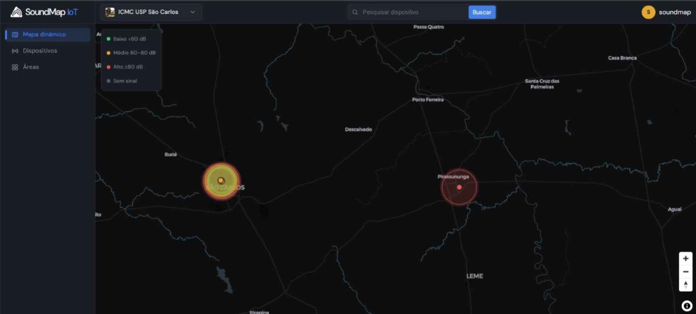
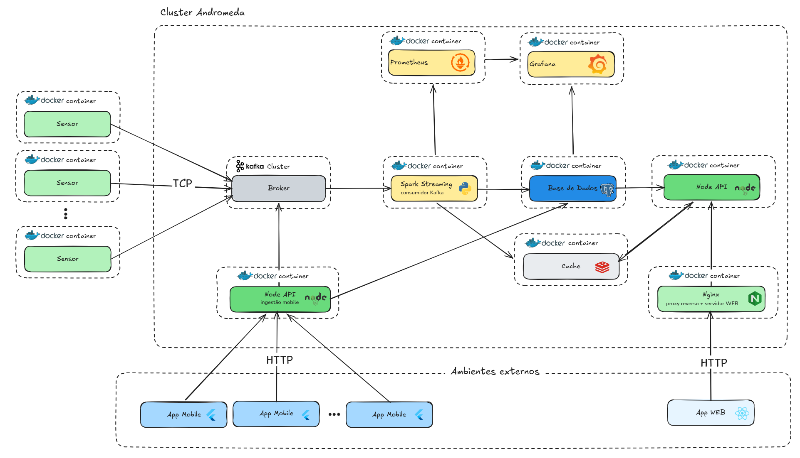

<h1 align="center">SoundMap<br/>
  Monitoramento de Ruído em Tempo Real
 </h1>


<p align="center">
  
</p>

Sistema de monitoramento e mapeamento de ruído urbano em tempo real, desenvolvido para a disciplina SSC0965 (ICMC/USP). A plataforma coleta leituras de sensores de decibéis, processa os dados via streaming com Apache Spark, e exibe mapas de intensidade sonora em aplicações web e mobile.

<p align="center">
  
</p>

---

## 👨‍💻 Desenvolvedores

<table align="center">
  <tr>
    <td align="center">
      <a href="https://github.com/brunorjanini">
        <br>
        <sub>
          <b>Bruno Janini</b>
        </sub>
      </a>
    </td>
    <td align="center">
      <a href="https://github.com/XandGVaz">
        <br>
        <sub>
          <b>Vitor Alexandre</b>
        </sub>
      </a>
    </td>
        <td align="center">
      <a href="https://github.com/reniba">
        <br>
        <sub>
          <b>Renan</b>
        </sub>
      </a>
    </td>
  </tr>
</table>

<p align="center">
  
</p>

---

## Arquitetura

```
┌─────────────────────────────────────────────────────────────────┐
│                        INGESTÃO DE DADOS                        │
│                                                                 │
│   Sensores (Python)  ──────►  Kafka (sensorData)                │
│   Clientes Mobile    ──────►  Kafka (appData)                   │
└──────────────────────────────────┬──────────────────────────────┘
                                   │
┌──────────────────────────────────▼──────────────────────────────┐
│                    PROCESSAMENTO (Apache Spark)                 │
│                                                                 │
│   Kafka Consumer → Janelas de 30s → Agregação dB ─┬→ PostgreSQL │
│                                                   └→ Redis      │
└──────────────────────────────────┬──────────────────────────────┘
                                   │
┌──────────────────────────────────▼──────────────────────────────┐
│                      PERSISTÊNCIA & CACHE                       │
│                                                                 │
│   PostgreSQL + TimescaleDB (séries temporais + métricas)        │
│   Redis (cache de intensidade para mapa)                        │
└──────────────────────────────────┬──────────────────────────────┘
                                   │
┌──────────────────────────────────▼──────────────────────────────┐
│                           APIs REST                             │
│                                                                 │
│   API Web  (4344)  ←── JWT ──►  API Mobile (4343)               │
└──────────────────────────────────┬──────────────────────────────┘
                                   │
┌──────────────────────────────────▼──────────────────────────────┐
│                     OBSERVABILIDADE                             │
│                                                                 │
│   Spark UI (4040) → Prometheus (9090) → Grafana (3000)          │
│   Kafka UI (8080)                                               │
└─────────────────────────────────────────────────────────────────┘
```

<p>
  
</p>


---

## Serviços

| Serviço          | Porta      | Descrição                                              |
| ---------------- | ---------- | ------------------------------------------------------ |
| `sensor`         | —          | Gerador de leituras de ruído (múltiplas réplicas)      |
| `kafka`          | 9092       | Message broker para ingestão de eventos                |
| `kafka-ui`       | 5384       | Interface web para inspeção do Kafka                   |
| `spark`          | 4040, 9091 | Processamento de stream com Spark Structured Streaming |
| `database`       | 5432       | PostgreSQL + TimescaleDB (dados e métricas)            |
| `redis`          | 6379       | Cache LRU para mapa de intensidade sonora              |
| `mobile_app_api` | 4343       | API REST para o app mobile                             |
| `web_app_api`    | 4344       | API REST para o app web                                |
| `prometheus`     | 9090       | Coleta de métricas do Spark                            |
| `grafana`        | 5284       | Dashboards de observabilidade                          |
| `frontend`       | 5184       | Coleta de métricas do Spark                            |

Todos os serviços se comunicam pela rede Docker interna `soundmap-net`.

---

## Pré-requisitos

- [Docker](https://docs.docker.com/get-docker/) 24+
- [Docker Compose](https://docs.docker.com/compose/install/) (incluído no Docker Desktop)
- `make`

---

## Execução local

### 1. Clonar o repositório

```bash
git clone <url-do-repositorio>
cd Soundmap
```

### 2. Criar o arquivo `.env`

Copie o exemplo e ajuste os valores conforme necessário:

```bash
cp .env.example .env
```

Principais variáveis:

| Variável            | Descrição                                                                      |
| ------------------- | ------------------------------------------------------------------------------ |
| `SENSOR_COUNT`      | Sensores simulados por container                                               |
| `SENSOR_NUMBER`     | Número de containers de sensores                                               |
| `FREQUENCY_HZ`      | Frequência de leitura em Hz                                                    |
| `EDGE_COMPUTING`    | `true` ativa pré-agregação no sensor (R5)                                      |
| `AREA_LAT`          | Latitude do centro da área monitorada (sensores gerados ao redor deste ponto)  |
| `AREA_LON`          | Longitude do centro da área monitorada                                         |
| `ROUND_ID`          | Identificador da rodada experimental                                           |
| `TRIGGER_INTERVAL`  | Intervalo do micro-batch do Spark                                              |
| `WINDOW_DURATION`   | Tamanho da janela de agregação do Spark (ex: `30 seconds`, `1 minute`)         |
| `WATERMARK`         | Tolerância a eventos atrasados — deve ser ≥ `WINDOW_DURATION` (ex: `1 minute`) |
| `SPARK_MASTER_CPUS` | Núcleos de CPU para o Spark                                                    |
| `API_USERNAME`      | Username do usuário seed dos sensores                                          |
| `API_EMAIL`         | E-mail do usuário seed dos sensores                                            |
| `API_PASSWORD`      | Senha do usuário seed dos sensores                                             |

> O usuário definido pelas variáveis `API_*` é criado automaticamente pelo seed na primeira inicialização e usado para registrar os sensores via API.
>
> `WINDOW_DURATION` controla a granularidade temporal dos dados em `Measure` e a frequência de atualização do Redis. `WATERMARK` define por quanto tempo o Spark aguarda eventos atrasados antes de fechar uma janela — reduzir o watermark diminui a latência de atualização do mapa.

### 3. Iniciar os serviços

```bash
make up          # sobe os serviços em segundo plano
# ou
make up-build    # reconstrói as imagens antes de subir
```

### 4. Verificar os serviços

Após ~30 segundos (Kafka e banco precisam inicializar):

| Interface  | URL                                 |
| ---------- | ----------------------------------- |
| Kafka UI   | http://localhost:5384               |
| Spark UI   | http://localhost:4040               |
| Prometheus | http://localhost:9090               |
| Grafana    | http://localhost:5284 (admin/admin) |
| API Web    | http://localhost:4344               |
| API Mobile | http://localhost:4343               |
| App Web    | http://localhost:5184               |

### 5. Encerrar

```bash
make down        # para os serviços e remove a rede
make clean       # para e APAGA os volumes (dados)
```

---

## Comandos `make`

```
make help        Lista todos os comandos disponíveis
make build       Constrói as imagens Docker (com cache)
make build-nc    Constrói as imagens Docker (sem cache)
make up          Sobe os serviços em background
make up-build    Reconstrói e sobe os serviços
make down        Para os serviços e remove a rede
make restart     Reinicia (down + up)
make logs        Exibe logs em tempo real (Ctrl+C para sair)
make ps          Lista os containers em execução
make clean       Para e APAGA todos os volumes  ⚠️ perda de dados
```

---

## Documentação por serviço

- [sensors/](sensors/) — Gerador de dados de sensores
- [spark/](spark/) — Pipeline de processamento de stream
- [database/](database/) — Esquema do banco de dados
- [grafana/](grafana/) — Dashboards de observabilidade
- [prometheus/](prometheus/) — Configuração de coleta de métricas

---

## Fluxo de dados

1. Cada container `sensor` gera leituras de ruído (55–95 dB) com localização GPS simulada e as publica no tópico Kafka `sensorData`.
2. O `spark` consome o tópico em micro-batches, agrega as leituras em janelas deslizantes de **30 segundos** (média logarítmica + pico), e persiste os resultados no PostgreSQL.
3. As APIs consultam o banco e o Redis para servir dados às aplicações cliente.
4. O Prometheus raspa métricas do Spark a cada 10 segundos; o Grafana exibe dashboards em tempo real.

---

## Rodadas experimentais (R1–R5)

O sistema foi projetado para executar experimentos de desempenho de streaming. A tabela `batch_metrics` no banco registra latência e throughput por batch, permitindo análise comparativa entre configurações.

| Rodada | Variável alterada                                                  |
| ------ | ------------------------------------------------------------------ |
| R1     | Configuração base                                                  |
| R2–R3  | `TRIGGER_INTERVAL` e `SPARK_MASTER_CPUS` variáveis, carga variável |

---


